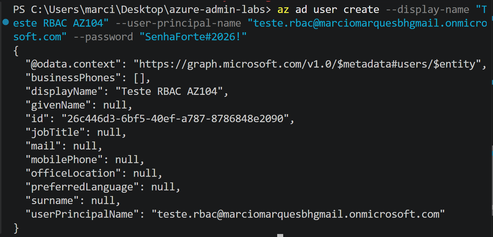
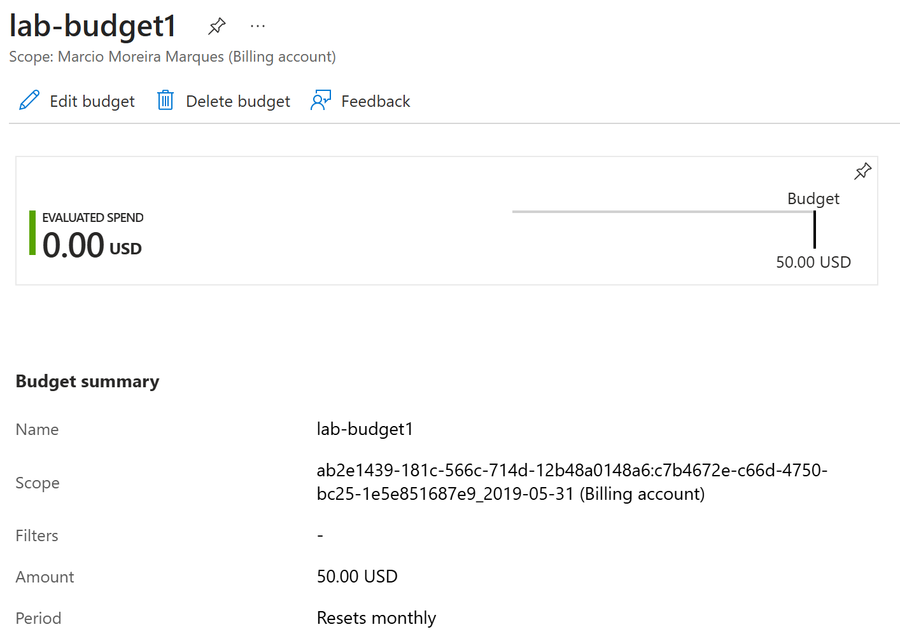
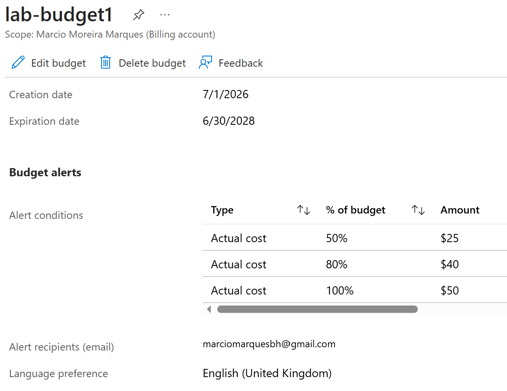
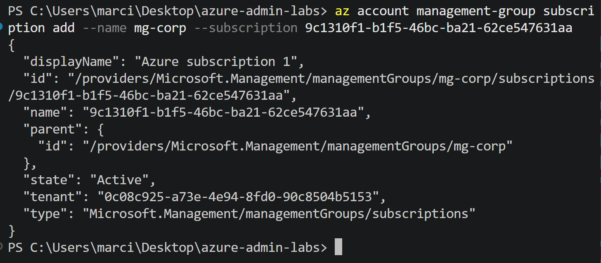
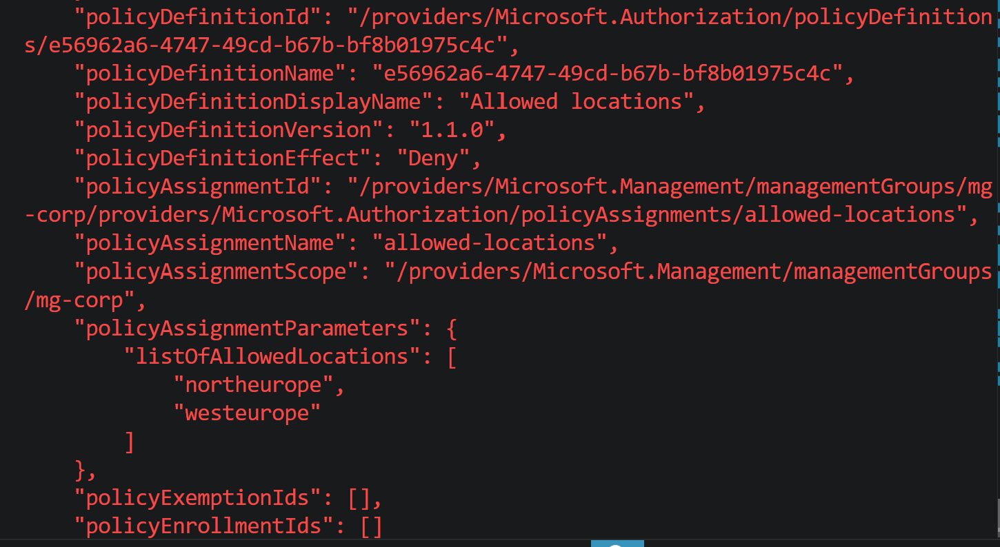
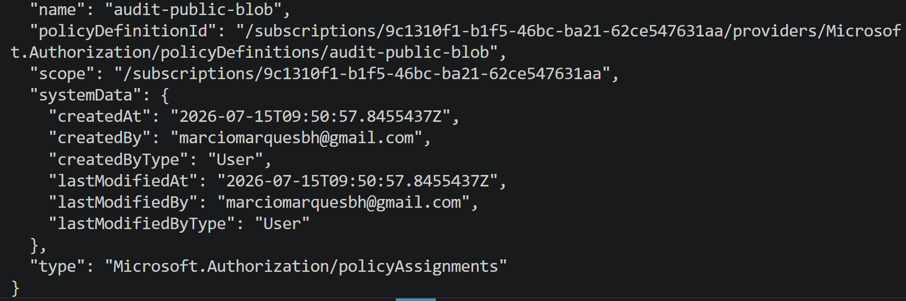

### Prerequisite — Test Identity

Created a test user in Microsoft Entra ID to be used as the target for the
RBAC assignment in Task 6 below.

**Command executed:**
```powershell
az ad user create --display-name "Test RBAC AZ104" --user-principal-name "teste.rbac@marciomarquesbhgmail.onmicrosoft.com" --password "SenhaForte#2026!"
```

**Result:** user created successfully (Object ID: `26c446d3-6bf5-40ef-a787-8786848e2090`).

<p align="center">
  
</p>

---

**Scenario:** A company needs guardrails before any workload is deployed: spending limits, allowed regions, mandatory cost-center tags, delete protection, and least-privilege access for a support team.

**AZ-104 skills:** management groups · Azure Policy (built-in + custom JSON) · RBAC · resource locks · tag governance · budgets

**Estimated cost:** ~ $0 (governance objects are free) · **Time:** 2–3 h

## Architecture

```
Tenant Root Group
└── mg-corp (management group)
    └── Subscription (free trial)
        ├── Policy: Allowed locations (Deny) — northeurope, westeurope
        ├── Policy: Inherit CostCenter tag (Modify)
        └── rg-lab01-governance
            ├── Lock: CanNotDelete
            └── Role assignment: Virtual Machine Contributor (scoped here)

Billing Account (Marcio Moreira Marques)
└── Budget: lab-budget1 ($50/month, alerts 50/80/100%)
```

## Tasks

### 1. Budget (completed)
Portal → Cost Management → Budgets → created `lab-budget1`, scope: **Billing Account** (Marcio Moreira Marques). Amount: $50.00 USD/month, resets monthly. Alerts (actual cost): 50% ($25), 80% ($40), 100% ($50) → email to marciomarquesbh@gmail.com.

**Note:** the original plan targeted Subscription scope; Azure Cost Management also supports Billing Account, Billing Profile, and Resource Group scopes. Billing Account scope was used here, which extends the guardrail to any future subscription under this billing account.

<p align="center">
  
  
</p>

### 2. Management group (completed)

```powershell
az account management-group create --name mg-corp --display-name "Corp"
az account management-group subscription add --name mg-corp --subscription 9c1310f1-b1f5-46bc-ba21-62ce547631aa
```

<p align="center">
  
</p>

### 3. Built-in policy — Allowed locations (Deny) (completed)

```powershell
az policy assignment create --name allowed-locations --scope /providers/Microsoft.Management/managementGroups/mg-corp --policy e56962a6-4747-49cd-b67b-bf8b01975c4c --params @labs/01-identity-governance/scripts/task3-params.json

az storage account create --name teststoragedeny01 --resource-group rg-lab1 --location eastus --sku Standard_LRS
```

**Result:** blocked with `RequestDisallowedByPolicy` — confirms the guardrail works.

**Note:** this built-in policy excludes `Microsoft.Resources/resourceGroups` from evaluation by default — it governs the location of resources *inside* a resource group, not the RG object itself.

<p align="center">
  
</p>

### 4. Custom policy — audit public blob access (completed)

```powershell
az policy definition create --name audit-public-blob --rules @labs/01-identity-governance/scripts/policy-audit-public-blob.json --mode Indexed

az policy assignment create --name audit-public-blob --scope /subscriptions/9c1310f1-b1f5-46bc-ba21-62ce547631aa --policy audit-public-blob
```

**Result:** custom policy definition and assignment created at subscription scope. Compliance evaluation for existing/new storage accounts can take up to ~30 minutes to appear in the Compliance view.

<p align="center">
  
</p>
