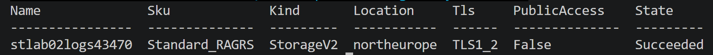
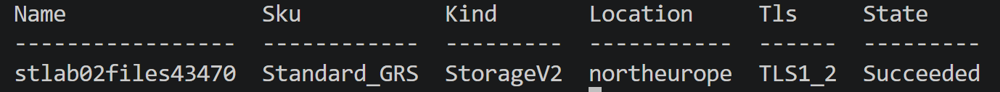

# Lab 02 — Secured Storage Platform

This lab sets up a storage platform for a company that keeps application logs and a departmental file share in Azure. The requirements are straightforward but layered: access has to be restricted to the internal network, old logs need to age out and get deleted automatically, data has to stay readable if the region goes down, and external partners occasionally need read access to a file or two without ever touching an account key. Building this out covers storage account replication (LRS, ZRS, GRS, RA-GRS), combining firewall rules with a VNet service endpoint, writing a lifecycle management policy in JSON, mounting an Azure Files share over SMB, generating a time-limited SAS token, and moving files with AzCopy. Total cost stays under a dollar if the resource group gets deleted within the week, and the whole thing takes somewhere around two to three hours.

## Architecture

```
rg-lab02-storage (northeurope)
├── vnet-lab02 / snet-app  -- service endpoint: Microsoft.Storage
├── stlab02logs<unique>    (StorageV2, RA-GRS)
│   ├── container: logs    (firewall: snet-app only)
│   └── lifecycle rule: Cool @30d -> Delete @365d
└── stlab02files<unique>   (Azure Files share: dept-share)
```

### 1. Storage Accounts and Replication Choice (Completed)

Started by creating the resource group and generating a random suffix in PowerShell, since account names have to be globally unique. From there, two storage accounts went up in the same resource group, each with a different redundancy tier depending on what it actually needs to protect against.

The logs account, `stlab02logs43470`, is set to RA-GRS. The requirement was read access during a regional outage without needing a manual failover, and RA-GRS is the only tier that keeps a secondary endpoint readable at all times, independent of what happens to the primary region.

| Redundancy | Copies kept | Scope | Read access to secondary |
| --- | --- | --- | --- |
| LRS | 3 | Single datacenter | No |
| ZRS | 3 | Three availability zones, primary region | No |
| GRS | 6 | Primary region plus paired secondary region | No, only after a failover |
| RA-GRS | 6 | Primary region plus paired secondary region | Yes, always on |

The files account, `stlab02files43470`, ended up on GRS instead of RA-GRS, and that wasn't a style choice, it's a hard limitation: Azure Files doesn't support RA-GRS or RA-GZRS at all. If you try to configure a file-share-enabled account that way, Azure just bills and treats it as GRS anyway, because there's no equivalent of a secondary read endpoint for SMB shares like there is for blobs. So for the departmental share, geo-redundancy is still there, but reading from the secondary region during an outage would require a full account failover first, not an always-on read endpoint.

Both accounts came up with `StorageV2`, TLS 1.2 as the minimum, and public blob access disabled from the start, since nothing here is meant to be reachable from the open internet before the network rules in the next task.

<p align="center">
  
  
</p>

