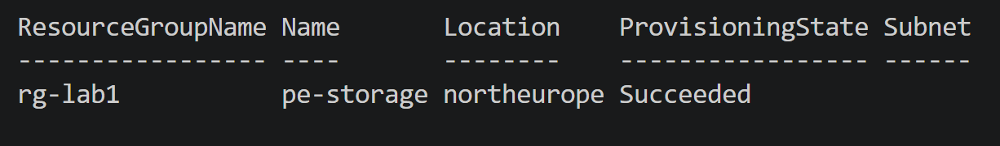

# Lab 04 — Hub-Spoke Network with Global Peering

**Scenario:** A hub-spoke topology across two regions, with shared services in the hub, private connectivity via global peering, layered NSG security, and a load-balanced backend.

**Requirements:** private connectivity via global peering, layered NSG security, and a load-balanced backend.

**AZ-104 skills covered:** VNets/subnets · global peering (both directions) · NSGs and effective security rules · route tables (UDR) · private DNS · Standard/Basic Load Balancer + health probes · Application Gateway · Private Endpoint · effective routes.

**Resource Group:** `rg-lab1` &nbsp;|&nbsp; **Region:** North Europe (West Europe was unavailable on Free Trial)

---

## 1. Virtual Network (VNet) + Subnet

Created two VNets to demonstrate both CLI and PowerShell workflows.

- **VNet (Bash/CLI):** `vnet-hub` — `10.0.0.0/16`, subnet `snet-mgmt` (`10.0.1.0/24`)
- **VNet (PowerShell):** `vnet-hub-ps` — originally `10.0.0.0/16`, later re-addressed to `10.1.0.0/16` (see Peering section)
- Scripts: `vnet-hub.sh`, `vnet-hub.ps1`

### Troubleshooting
- **Bash line continuation (`\`) used in PowerShell** — PowerShell doesn't support `\` for line continuation (that's Bash/Linux syntax). Each line was parsed as a new command. **Fix:** use the backtick `` ` `` for line continuation in PowerShell, or type the command on a single line.
- **`RequestDisallowedByAzure` — region unavailable** — West Europe was not accepting new resources on the Free Trial subscription. **Fix:** specify `--location northeurope` (CLI) / `-Location "northeurope"` (PowerShell), and set a default with `az config set defaults.location=northeurope`.

---

## 2. Network Security Group (NSG)

Created an NSG (`nsg-mgmt`) with an inbound rule allowing RDP (port 3389), associated with subnet `snet-mgmt` of VNet `vnet-hub`.

- NSG: `nsg-mgmt`
- Rule: Allow RDP (TCP 3389), priority 100
- Scripts: `nsg-mgmt.ps1` (CLI equivalent documented inline)

---

## 3. Route Table (UDR) — Custom Routing

Created a Route Table (`rt-mgmt`) with a custom route (UDR) forcing outbound internet traffic through a virtual firewall appliance (NVA), associated with subnet `snet-mgmt` of VNet `vnet-hub`.

- Route Table: `rt-mgmt`
- Route: `force-firewall` — destination `0.0.0.0/0`, Next Hop Type `VirtualAppliance`, pointing to `10.0.2.4` (fictitious NVA IP, for demonstration purposes)
- Script: `routetable-mgmt.ps1`

**Note:** `EnableDdosProtection: False` is the expected state — DDoS Protection Standard is a paid add-on, not enabled in this study environment (Free Trial). DDoS Basic remains active automatically at no cost.

### Troubleshooting
Two PowerShell environment issues occurred during this lab (unrelated to networking command syntax):
1. **`TypeLoadException` across Az modules** — caused by a corrupted `Az.Network` installation. Fixed with `Uninstall-Module` followed by a clean reinstall (`Install-Module -Name Az.Accounts` and `Az.Network`).
2. **Expired authentication token after reinstall** — fixed by reconnecting with `Connect-AzAccount -UseDeviceAuthentication -TenantId <tenant-id>`.

---

## 4. Peering between VNets

Configured bidirectional peering between `vnet-hub` and `vnet-hub-ps`.

- Peering: `hub-to-hubps` and `hubps-to-hub` — both `Connected`
- Script: `peering-hub.ps1`

### Troubleshooting: IP address overlap
The initial peering attempt failed with an `overlapping address space` error — `vnet-hub` and `vnet-hub-ps` shared the same range (`10.0.0.0/16`). VNet peering requires non-overlapping address spaces.

**Fix:** re-addressed `vnet-hub-ps` to `10.1.0.0/16` (subnet `10.1.1.0/24`), eliminating the overlap. Peering was then created successfully in both directions.

---

## 5. Private DNS Zone

Created a private DNS zone (`contoso.internal`), linked to VNet `vnet-hub` with autoregistration enabled, plus a manual A record example.

- Zone: `contoso.internal` (global resource, no region)
- Link: `link-hub` → `vnet-hub`, with autoregistration
- Record: `vm-app01` → `10.0.1.10`
- Script: `privatedns-hub.ps1`

### Troubleshooting
Same `TypeLoadException` pattern seen in the Route Table lab (`Az.Network`), this time in the `Az.PrivateDns` module. Fixed with `Uninstall-Module` + clean reinstall of the specific module, followed by reconnecting via `Connect-AzAccount`.

---

## 6. Internal Load Balancer

Created an Internal Load Balancer (`lb-internal`) with a private frontend IP, backend pool, HTTP health probe, and a TCP port 80 load-balancing rule.

- Load Balancer: `lb-internal` — SKU **Basic** (free)
- Private frontend IP: `10.0.1.100` (subnet `snet-mgmt`)
- Script: `loadbalancer-internal.ps1`

**Technical decision:** chose Basic SKU over Standard for this lab, since the scenario (internal use, no SLA/availability zone requirement) didn't justify the Standard cost. Resource removed after validation (`Remove-AzLoadBalancer`), following the environment's cost discipline.

---

## 7. Application Gateway

Created an Application Gateway (`appgw-web`), SKU Standard_v2, with a basic HTTP listener and a simple routing rule, demonstrating the core components (dedicated subnet, public frontend IP, backend pool, HTTP settings, listener, routing rule).

- Application Gateway: `appgw-web` — SKU **Standard_v2**
- Dedicated subnet: `snet-appgw` (`10.0.2.0/24`)
- Script: `appgateway-web.ps1`

**Cost discipline:** resource removed immediately after validation (`Remove-AzApplicationGateway` + `Remove-AzPublicIpAddress`), since Application Gateway has no free SKU and bills per hour of provisioning (~15–20 min deploy time).

### Troubleshooting
Another `TypeLoadException` episode in the `Az.Network` module (third occurrence in the networking domain), this time while creating the dedicated subnet. Same resolution pattern: clean reinstall of `Az.Accounts` + `Az.Network`, followed by reconnecting via `Connect-AzAccount`.

After a fourth occurrence of this same error (while querying the deleted Application Gateway), a **full module cleanup** was performed instead of a targeted fix: all `Az.*` modules were uninstalled and the complete `Az` module was reinstalled from scratch. This resolved the recurring instability permanently.

---

## 8. Private Endpoint

Created a Private Endpoint (`pe-storage`) connecting Storage Account `storagebashpowershell` (`blob` group) directly to subnet `snet-mgmt` of VNet `vnet-hub`, with a private IP inside the network.

- Private Endpoint: `pe-storage`
- Target: Storage Account `storagebashpowershell`, group `blob`
- Script: `privateendpoint-storage.ps1`

**Note:** integrated Private DNS Zone was not configured in this lab (scope focused on the Private Endpoint creation itself). Without that integration, name resolution for the service would still point to its public IP from machines outside the VNet — documented here as a follow-up hardening step.

Resource removed after validation (`Remove-AzPrivateEndpoint`), following the environment's cost discipline.

---

## Environment Notes

- **PowerShell module maintenance:** the `Az.Network`-family modules exhibited a recurring `TypeLoadException` (`get_SerializationSettings has no implementation`) across multiple labs. Root cause: a corrupted/misaligned module installation. Point fixes (reinstalling individual modules) resolved it temporarily; a full `Az` module reinstall resolved it permanently.
- **Cost discipline:** free resources (VNet, NSG, Route Table, Peering, Private DNS) were left running with no cost impact. Paid resources (Load Balancer Standard avoided in favor of Basic, Application Gateway, Private Endpoint) were deleted immediately after validating successful deployment.