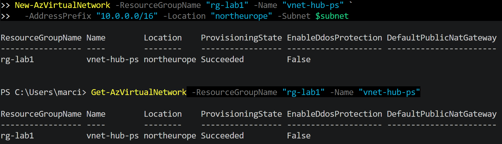
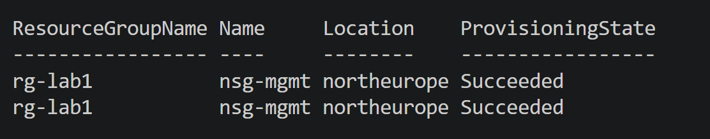
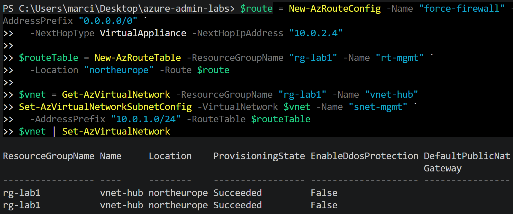
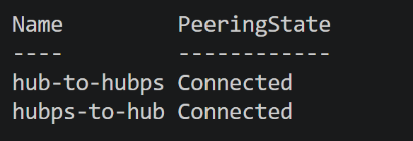
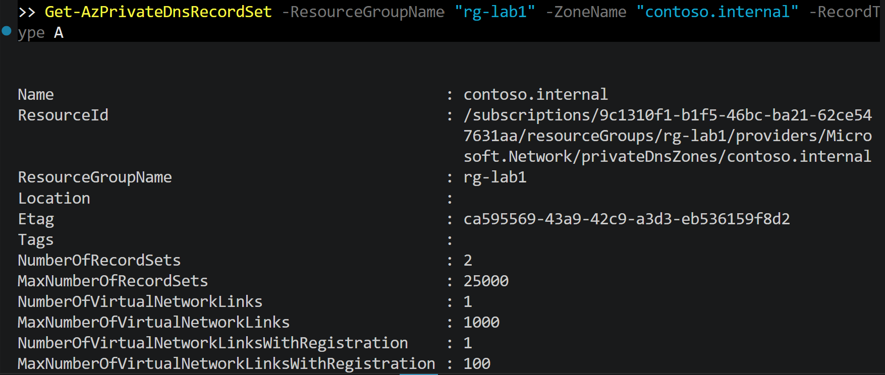
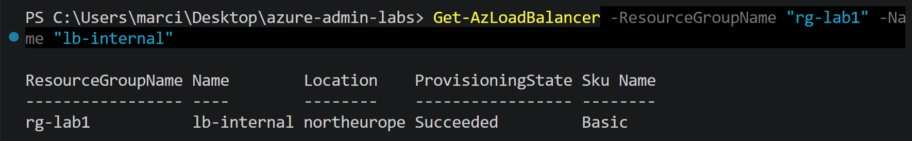
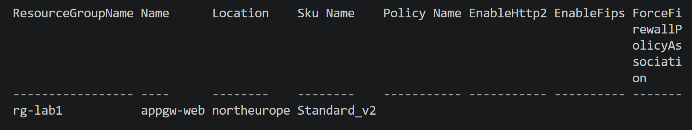

# Lab 04 — Hub-Spoke Network with Global Peering

**Scenario:** A hub-spoke topology across two regions: shared services in the hub (West Europe), an application spoke in North Europe. Requirements: private connectivity via global peering, layered NSG security, internal name resolution, secure admin access without public IPs, and a load-balanced backend.

**AZ-104 skills:** VNets/subnets · global peering (both directions) · NSGs at subnet **and** NIC level · service tags · private DNS zones + links · Azure Bastion · Standard Load Balancer + health probes · effective routes

**Estimated cost:** €2–6 — the Load Balancer and Bastion bill hourly; complete those tasks in one sitting and delete. Use the **Bastion Developer SKU if available in your region** (free); otherwise deploy Basic/Standard and remove it the same day. · **Time:** 4–5 h (the deepest lab — this was my weakest exam domain, so it gets the most rigor)

## Architecture

```
vnet-hub (westeurope, 10.0.0.0/16)          vnet-spoke1 (northeurope, 10.1.0.0/16)
├── snet-data (10.0.2.0/24)                 ├── snet-app (10.1.1.0/24)
│   └── vm-sql1  [nsg-data + nsg-nic]       │   └── vm-app1 [nsg-app]
├── snet-web  (10.0.1.0/24)                 │
│   ├── vm-web1 ─┐                          │
│   └── vm-web2 ─┴─ lb-web (Standard, internal)
├── AzureBastionSubnet (/26)                │
│   └── bastion-hub                         │
└── Private DNS zone: corp.internal ── links: vnet-hub (auto-reg) + vnet-spoke1
            └────────── global peering (both directions) ──────────┘
```

## Tasks

### 1. VNets and subnets (CLI)
```bash
az group create -n rg-lab04-network -l westeurope --tags CostCenter=LAB
az network vnet create -g rg-lab04-network -n vnet-hub -l westeurope \
  --address-prefix 10.0.0.0/16 \
  --subnet-name snet-web --subnet-prefix 10.0.1.0/24
az network vnet subnet create -g rg-lab04-network --vnet-name vnet-hub \
  -n snet-data --address-prefix 10.0.2.0/24
az network vnet subnet create -g rg-lab04-network --vnet-name vnet-hub \
  -n AzureBastionSubnet --address-prefix 10.0.255.0/26
az network vnet create -g rg-lab04-network -n vnet-spoke1 -l northeurope \
  --address-prefix 10.1.0.0/16 \
  --subnet-name snet-app --subnet-prefix 10.1.1.0/24
```
Document why `AzureBastionSubnet` must have exactly that name and at least /26.

### 2. Global peering — both directions, on purpose
Create only the hub→spoke peering first; screenshot the **"Initiated"** state; then create spoke→hub and screenshot **"Connected"**. This demonstrates the most common peering misconfiguration.
```bash
SPOKE_ID=$(az network vnet show -g rg-lab04-network -n vnet-spoke1 --query id -o tsv)
HUB_ID=$(az network vnet show -g rg-lab04-network -n vnet-hub --query id -o tsv)
az network vnet peering create -g rg-lab04-network -n HubToSpoke1 \
  --vnet-name vnet-hub --remote-vnet $SPOKE_ID --allow-vnet-access
# check state here → Initiated
az network vnet peering create -g rg-lab04-network -n Spoke1ToHub \
  --vnet-name vnet-spoke1 --remote-vnet $HUB_ID --allow-vnet-access
# check state here → Connected
```

### 3. Layered NSGs — prove the two-gate rule
Deploy `vm-sql1` (B1s, no public IP) in `snet-data` and `vm-app1` in `snet-app`.
- `nsg-data` (subnet): allow TCP 1433 from 10.1.0.0/16, priority 100
- `nsg-nic` (attached to vm-sql1 NIC): first add `Deny_All_Inbound` priority 100 → **test from vm-app1 and show the connection failing** even though the subnet NSG allows it
- Then add an allow rule for 1433 at priority 90 on the NIC NSG → test again, show success

This before/after is the strongest possible evidence of understanding NSG evaluation (subnet **and** NIC must both allow; lowest priority number wins).

### 4. Service tags
Add an inbound rule allowing the `AzureLoadBalancer` service tag on the web NSG and document why (health probes originate from 168.63.129.16).

### 5. Private DNS zone
```bash
az network private-dns zone create -g rg-lab04-network -n corp.internal
az network private-dns link vnet create -g rg-lab04-network -z corp.internal \
  -n link-hub -v vnet-hub -e true          # auto-registration
az network private-dns link vnet create -g rg-lab04-network -z corp.internal \
  -n link-spoke1 -v vnet-spoke1 -e false   # resolution only
```
**Validation:** from vm-app1, `nslookup vm-sql1.corp.internal` — first WITHOUT the spoke link (fails), then with it (succeeds). Document link vs auto-registration.

### 6. Bastion — admin access without public IPs
Deploy Bastion (Developer SKU if offered; otherwise Basic — delete same day) and connect to vm-sql1 through the browser. Screenshot the session and the VM overview showing **no public IP**.

### 7. Standard Load Balancer
Two web VMs (`vm-web1/2`, Nginx serving a page with the hostname), internal Standard LB, backend pool, HTTP health probe on port 80, LB rule. From vm-app1, `curl` the frontend IP repeatedly and capture responses alternating between the two hostnames. Then stop Nginx on vm-web1 and show traffic converging on vm-web2 (probe in action).

### 8. Effective routes
```bash
az network nic show-effective-route-table -g rg-lab04-network \
  -n <vm-app1-nic> -o table
```
Highlight the `VNetGlobalPeering` route in the output — proof the peering carries the traffic.

## Evidence checklist
- [ ] Peering state Initiated → Connected
- [ ] Connection blocked by NIC NSG, then allowed after priority-90 rule
- [ ] nslookup failing → succeeding after DNS link
- [ ] Bastion session to a VM with no public IP
- [ ] curl alternating backends; failover after stopping one
- [ ] Effective route table with the peering route

## What broke and how I fixed it
*(fill in — this section is gold in interviews)*

## Cleanup
```bash
az group delete -n rg-lab04-network --yes --no-wait
```
## Versão PowerShell

Mesmo lab replicado via PowerShell (`Az.Network` module), para demonstrar 
competência nas duas ferramentas exigidas pelo exame AZ-104.

- VNet: `vnet-hub-ps` (mesmo address space, nome diferente para evitar conflito)
- Script: `vnet-hub.ps1`


## NSG — Network Security Group

Criado um NSG (`nsg-mgmt`) com regra de entrada permitindo RDP (porta 3389),
associado à subnet `snet-mgmt` da VNet `vnet-hub`.

- NSG: `nsg-mgmt`
- Regra: Allow RDP (TCP 3389), prioridade 100
- Script: `nsg-mgmt.ps1`


## Route Table (UDR) — Roteamento customizado

Criada uma Route Table (`rt-mgmt`) com uma rota customizada (UDR) forçando 
tráfego de saída da internet a passar por um firewall virtual (NVA), 
associada à subnet `snet-mgmt` da VNet `vnet-hub`.

- Route Table: `rt-mgmt`
- Rota: `force-firewall` — destino `0.0.0.0/0`, Next Hop Type `VirtualAppliance`, 
  apontando para `10.0.2.4` (IP fictício de NVA, para fins didáticos)
- Script: `routetable-mgmt.ps1`

**Nota:** `EnableDdosProtection: False` é o estado esperado — DDoS Protection 
Standard é um recurso pago à parte, não habilitado neste ambiente de estudo 
(Free Trial). A proteção DDoS Basic permanece ativa automaticamente e sem custo.

## Troubleshooting

Durante este lab, ocorreram dois problemas de ambiente PowerShell (não relacionados 
à sintaxe dos comandos de rede):

1. **TypeLoadException entre módulos Az** — causado por uma instalação corrompida 
   do `Az.Network`. Resolvido com `Uninstall-Module` seguido de reinstalação limpa 
   (`Install-Module -Name Az.Accounts` e `Az.Network`).
2. **Token de autenticação expirado após reinstalação** — resolvido reconectando 
   com `Connect-AzAccount -UseDeviceAuthentication -TenantId <tenant-id>`.


## Peering entre VNets

Configurado peering bidirecional entre `vnet-hub` e `vnet-hub-ps`.

- Peering: `hub-to-hubps` e `hubps-to-hub` — ambos `Connected`
- Script: `peering-hub.ps1`

### Troubleshooting: overlap de endereçamento IP

Tentativa inicial de peering falhou porque `vnet-hub` e `vnet-hub-ps` 
compartilhavam o mesmo range (`10.0.0.0/16`). Peering entre VNets exige 
endereçamento sem sobreposição.

**Solução:** reendereçado `vnet-hub-ps` para `10.1.0.0/16` (subnet `10.1.1.0/24`), 
eliminando o overlap. Peering criado com sucesso nos dois sentidos.


## Private DNS Zone

Criada zona DNS privada (`contoso.internal`), linkada à VNet `vnet-hub` com 
autoregistration habilitada, e um registro A manual de exemplo.

- Zona: `contoso.internal` (recurso global, sem região)
- Link: `link-hub` → `vnet-hub`, com autoregistration
- Registro: `vm-app01` → `10.0.1.10`
- Script: `privatedns-hub.ps1`

### Troubleshooting

Mesmo padrão de `TypeLoadException` já visto no lab de Route Table (Az.Network), 
desta vez no módulo `Az.PrivateDns`. Resolvido com `Uninstall-Module` + 
reinstalação limpa do módulo específico, seguido de reconexão com `Connect-AzAccount`.


## Internal Load Balancer

Criado Internal Load Balancer (`lb-internal`) com frontend IP privado, 
backend pool, health probe HTTP e regra de balanceamento TCP porta 80.

- Load Balancer: `lb-internal` — SKU **Basic** (gratuito)
- Frontend IP privado: `10.0.1.100` (subnet `snet-mgmt`)
- Script: `loadbalancer-internal.ps1`

**Decisão técnica:** optado por SKU Basic em vez de Standard neste lab, 
já que o cenário (uso interno, sem necessidade de SLA/zonas de disponibilidade) 
não justifica o custo do Standard. Recurso removido após validação 
(`Remove-AzLoadBalancer`), seguindo disciplina de custo do ambiente de estudo.


## Application Gateway

Criado Application Gateway (`appgw-web`), SKU Standard_v2, com listener HTTP 
básico e regra de roteamento simples, demonstrando os componentes centrais 
(subnet dedicada, frontend IP público, backend pool, HTTP settings, listener, 
routing rule).

- Application Gateway: `appgw-web` — SKU **Standard_v2**
- Subnet dedicada: `snet-appgw` (10.0.2.0/24)
- Script: `appgateway-web.ps1`

**Disciplina de custo:** recurso removido imediatamente após validação 
(`Remove-AzApplicationGateway` + `Remove-AzPublicIpAddress`), já que 
Application Gateway não possui SKU gratuito e cobra por hora de provisionamento 
(~15-20 min de deploy).

### Troubleshooting

Novo episódio de `TypeLoadException` no módulo `Az.Network` (terceira ocorrência 
no domínio de Redes), desta vez ao criar a subnet dedicada. Mesmo padrão de 
resolução: reinstalação limpa de `Az.Accounts` + `Az.Network`, seguida de 
reconexão via `Connect-AzAccount`.


